## idea中maven配置

```markdown
# 1.配置maven工具
- 在idea中打开如下位置：Preferences | Build,Execution,Deployment | Build Tools | Maven
- 按照如下配置
```
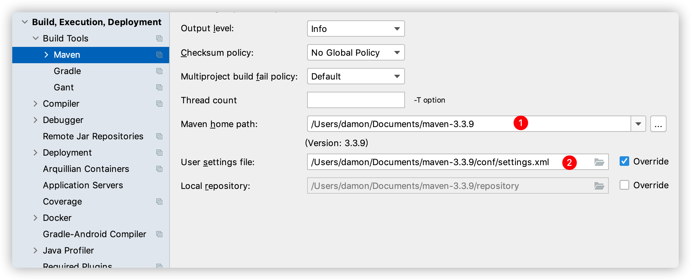

```markdown
# 2.配置maven阿里云镜像仓库
```
>setting.xml文件
```xml
<mirrors>
  <mirror>
     <id>nexus-aliyun</id>
     <mirrorOf>*</mirrorOf>
     <name>Nexus aliyun</name>
    <url>http://maven.aliyun.com/nexus/content/groups/public</url>
  </mirror> 
</mirrors>
```
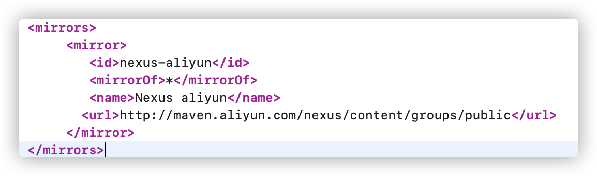

## mybatis

## 1.mybatis引言

```markdown
# 1.什么是mybatis
- 定义：mybatis是用来完成数据库操作的半ORM框架   官方定义：MyBatis是一款优秀的持久层（mysql，oracle）框架
    （Hibernate ORM框架）==> 表t_user(id,name) java对象转化 User id name
     ORM：Object Relationship Mapping 对象 关系 映射
     半ORM：mybatis中自己在mapper配置文件中自己书写字段和对象属性映射关系
     
- 作用：用来操作数据库 mysql oracle sqlServer等，解决了原始JDBC编程技术中代码冗余，方便访问数据库
```

## 2.第一个入门环境

```markdown
# 1.创建maven项目
```
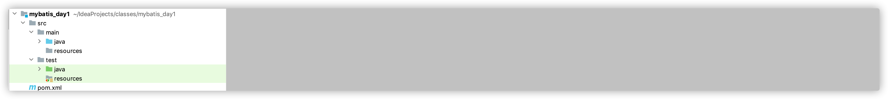
```markdown
# 2.项目中引入mybatis依赖
```
```xml
    <!--mybatis依赖-->
    <dependency>
      <groupId>org.mybatis</groupId>
      <artifactId>mybatis</artifactId>
      <version>3.4.6</version>
    </dependency>

    <!--引入mysql驱动jar包-->
    <dependency>
      <groupId>mysql</groupId>
      <artifactId>mysql-connector-java</artifactId>
      <version>5.1.38</version>
    </dependency>
```

```markdown
# 3.mybatis的主配置文件
- 主配置文件：核心配置文件 作用：用来创建SqlSessionFactory
```
>XML 配置文件中包含了对 MyBatis 系统的核心设置，包括获取数据库连接实例的数据源（DataSource）以及决定事务作用域和控制方式的事务管理器（TransactionManager）。

>/resources/mybatis-config.xml
```xml
<configuration>
    <!--  环境：操作哪个数据库  environments环境复数 prod dev test...-->
    <environments default="prod">
        <!--   生产环境     -->
        <environment id="prod">
            <transactionManager type="JDBC"/>
            <dataSource type="POOLED">
                <property name="driver" value="com.mysql.jdbc.Driver"/>
                <property name="url" value="jdbc:mysql://localhost:3306/mybatis"/>
                <property name="username" value="root"/>
                <property name="password" value="root"/>
            </dataSource>
        </environment>
    </environments>
</configuration>
```
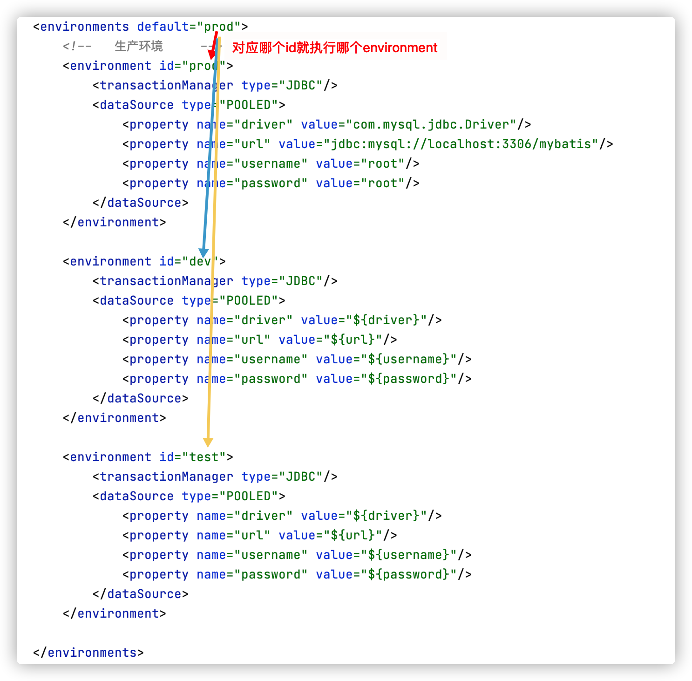

```markdown
# 4.获取sqlSession
```
```java
//读取mybatis-config.xml
InputStream is = Resources.getResourceAsStream("mybatis-config.xml");
//创建mybatis核心对象SqlSessionFactory
SqlSessionFactory sqlSessionFactory = new SqlSessionFactoryBuilder().build(is);
//获取sqlSession
SqlSession sqlSession = sqlSessionFactory.openSession();

System.out.println(sqlSession);
```
```markdown
# 5.建表
```
```sql
set names utf8mb4;
set foreign_key_checks = 0;
-- -----------------------------
-- Table structure for t_user
-- -----------------------------
drop table if exists 't_user';
create table 't_user' (
    'id' int (6) not null auto_increment,
    'name' varchar(40) default null,
    'age' int(3) default null,
    'bir' timestamp null default null,
    primary key ('id')
) engine=InnoDB default charset=utf8;

set foreign_key_checks = 1;
```
```markdown
# 6.实体对象 entity(实体)/model(模型) com.baizhi.entity/com.baizhi.model
```
```java
public class User {
    private Integer id;
    private String name;
    private Integer age;
    private Date bir;
    //get set 有参构造 无参数构造省略 toString省略
}
```
```markdown
# 7.开发DAO接口
- 注意：mybatis要求接口中不能定义方法的重载
```
```java
public interface UserDAO {
    //保存用户
    int save(User user);
}
```
```markdown
# 8.开发Mapper配置文件
- 注意：在mybatis中一个DAO接口对应一个Mapper配置文件 idea中建立配置文件目录使用‘/’
```
```xml
<!--
    namespace属性：命名空间 用来书写当前mapper文件是对哪个DAO接口的实现
    全限定名：包.类
-->
<mapper namespace="com.baizhi.dao.UserDAO">
    <!--保存
        insert：插入操作
        id：方法名
        parameterType：参数类型 包.类
        注意：1.insert标签内部写sql语句
             2.#(对象中属性名)
     -->
    <insert id="save" parameterType="com.baizhi.entity.User">
        insert into t_user values (#{id},#{name},#{age},#{bir})
    </insert>
</mapper>
```
```markdown
# 9.将mapper注册到mybatis-config.xml配置文件中
```
```xml
<!--  注册项目中mapper.xml配置文件  -->
<mappers>
   <mapper resource="com/baizhi/mapper/UserDAO.xml"/>
</mappers>
```
```markdown
# 10.测试UserDAO
```
```java
public static void main(String[] args) throws IOException {
        //读取mybatis-config.xml
        InputStream is = Resources.getResourceAsStream("mybatis-config.xml");
        //创建mybatis核心对象SqlSessionFactory
        SqlSessionFactory sqlSessionFactory = new SqlSessionFactoryBuilder().build(is);
        //获取sqlSession
        SqlSession sqlSession = sqlSessionFactory.openSession();
        //获取DAO对象
        UserDAO userDAO = sqlSession.getMapper(UserDAO.class);
        try {
            User user = new User();
            user.setId(1);//不设置id使用数据库自动生成id
            user.setName("小王");
            user.setAge(23);
            user.setBir(new Date());
            int count = userDAO.save(user);
            System.out.println("影响的条数："+count);
            sqlSession.commit();//提交事务
        }catch (Exception e){
            e.printStackTrace();
            sqlSession.rollback();//提交事务
        }finally {
            sqlSession.close();//释放资源
        }

    }
```

### 2.1 mybatis执行过程中数据库乱码问题
```markdown
# 1.为什么会出现乱码？
- Java中的编码在通过不同操作系统底层传递过程中由于和操作系统的编码不一致就会出现乱码
# 2.解决方案
```
```xml
<property name="url" value="jdbc:mysql://localhost:3306/mybatis?characterEncoding=utf-8"/>
```
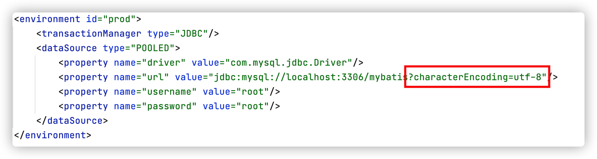

### 2.2 mybatis中插入如何返回数据库自动生成id

```java
UserDAO userDAO = sqlSession.getMapper(UserDAO.class);
    try {
        User user = new User();
        user.setId(1);//不设置id使用数据库自动生成id
        user.setName("小王");
        user.setAge(23);
        user.setBir(new Date());
        int count = userDAO.save(user);
        System.out.println("影响的条数"+count);
        //数据当前保存这条记录id
        System.out.println("本次数据库生成id："+user.getId());
        sqlSession.commit();//提交事务
    }catch (Exception e){
        e.printStackTrace();
        sqlSession.rollback();//提交事务
    }finally {
        sqlSession.close();//释放资源
    }
```
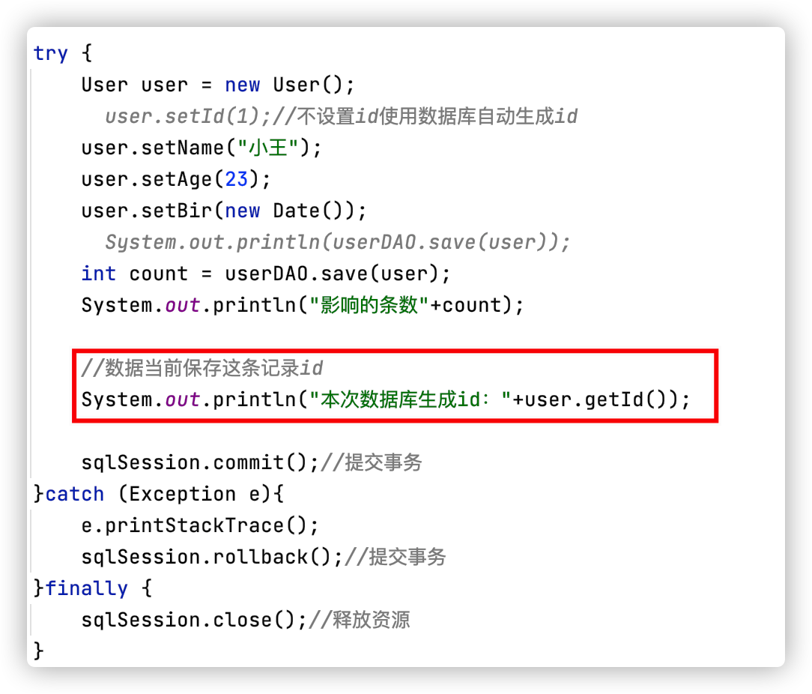

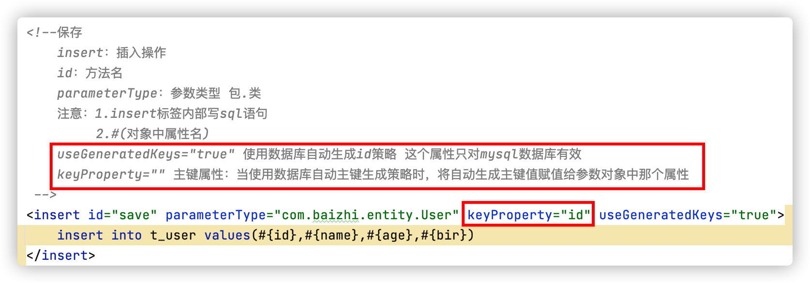

***
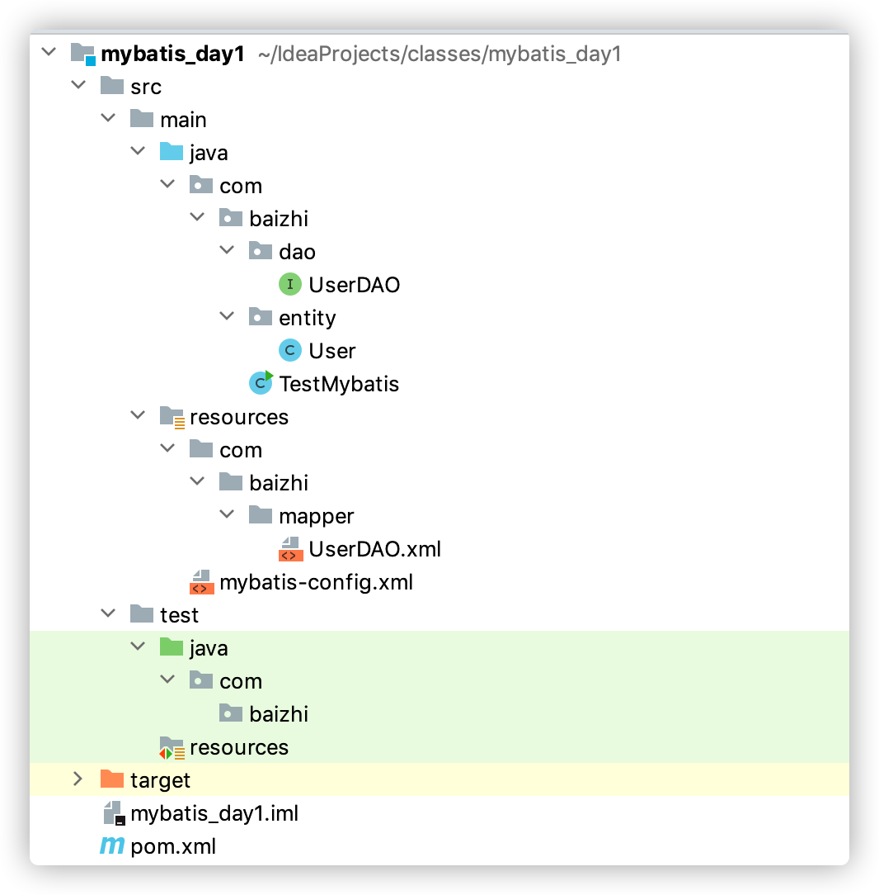

## 3.Mybatis中CRUD

### 3.1 记录更新操作

> userDAO.java

```java
public interface UserDAO {
    //更新方法
    int update(User user);
}
```

> userDAO.xml

```xml
<!-- 更新方法 -->
<update id="update" parameterType="com.baizhi.entity.User">
    update t_user
        <set><!-- set标签动态去掉 赋值语句前后多余的逗号 -->
            <!-- test里面属性name为对象的属性名 -->
            <if test="name!=null and name!=''">
                name=#{name},
            </if>
            <if test="age!=null">
                age=#{age},
            </if>
            <if test="bir!=null">
                bir=#{bir}
            </if>
        </set>
    where id = #{id}
</update>
```

> 测试

```java
//更新操作
@Test
public void update() throws IOException {
    //读取配置文件
    InputStream is = Resources.getResourceAsStream("mybatis-config.xml");
    //创建sqlSessionFactory
    SqlSessionFactory sqlSessionFactory = new SqlSessionFactoryBuilder().build(is);
    //获取sqlSession执行sql语句
    SqlSession sqlSession = sqlSessionFactory.openSession();
    try {
        //获取DAO对象
        UserDAO userDAO = sqlSession.getMapper(UserDAO.class);
        // 更新数据
        // 更新：有值更新 不存在值保留原始的值 1.先查再改 2.动态sql
        User user = new User();
        user.setId(1);
        user.setName("小王吧");
        userDAO.update(user);
        int update = userDAO.update(user);
        System.out.println("修改的条数："+ update);
        sqlSession.commit(); //提交
    } catch (Exception e) {
        e.printStackTrace();
        sqlSession.rollback();
    } finally {
        sqlSession.close();
    }
}
```


### 3.2 删除操作

> userDAO.java

```java
public interface UserDAO {
    //删除方法
    int delete(Integer id);
}
```

> userDAO.xml

```xml
<!-- 删除方法 -->
<delete id="delete" parameterType="Integer">
    delete from t_user where id = #{id}
</delete>
```

> 测试

```java
//删除操作
@Test
public void delete() throws IOException {
  //读取配置文件
  InputStream is = Resources.getResourceAsStream("mybatis-config.xml");
  //创建sqlSessionFactory
  SqlSessionFactory sqlSessionFactory = new SqlSessionFactoryBuilder().build(is);
  //获取sqlSession执行sql语句
  SqlSession sqlSession = sqlSessionFactory.openSession();
  try {
    UserDAO userDAO = sqlSession.getMapper(UserDAO.class);
    int delete = userDAO.delete(4);
    System.out.println("删除的条数："+delete);
    sqlSession.commit();
  } catch (Exception e) {
    e.printStackTrace();
    sqlSession.rollback();
  } finally {
    sqlSession.close();
  }
}
```

### 3.3 封装工具类

> MybatisUtil.java

```java
public class MybatisUtil {
    //定义静态变量
    private static SqlSessionFactory sqlSessionFactory;
    //静态代码块 static 特点：类加载时候执行 只执行一次
    static{
        //读取配置文件
        InputStream is = null;
        try {
            is = Resources.getResourceAsStream("mybatis-config.xml");
            //创建sqlSessionFactory
            SqlSessionFactory sqlSessionFactory = new SqlSessionFactoryBuilder().build(is);
        } catch (IOException e) {
            e.printStackTrace();
        } finally {
            try {
                is.close();
            } catch (IOException e) {
                e.printStackTrace();
            }
        }
    }
    //提供sqlSession
    public static SqlSession getSqlSession(){
        //获取sqlSession执行sql语句
        SqlSession sqlSession = sqlSessionFactory.openSession();
        return sqlSession;
    }
    //关闭selSession
    public static void close(SqlSession sqlSession){
        sqlSession.close();
    }
}
```

> 创建工具类后代码示例

```java
//删除操作
@Test
public void delete() throws IOException {
  SqlSession sqlSession = MybatisUtil.getSqlSession();
  try {
    UserDAO userDAO = sqlSession.getMapper(UserDAO.class);
    int delete = userDAO.delete(4);
    System.out.println("删除的条数："+delete);
    sqlSession.commit();
  } catch (Exception e) {
    e.printStackTrace();
    sqlSession.rollback();
  } finally {
    MybatisUtil.close(sqlSession);
  }
}
```

### 3.4 mybatis查询操作

#### 3.4.1 查询所有

```java
  //查询所有方法
  List<User> queryAll();
```

```xml
  <!--查询所有
      resultType: list集合的泛型类型 com.baizhi.entity.User
  -->
  <select id="queryAll" resultType="com.baizhi.entity.User">
      select id,name,age,bir from t_user
  </select>
```

```java
//查询所有
@Test
public void testQueryAll() {
    SqlSession sqlSession = MybatisUtil.getSqlSession();
    UserDAO userDAO = sqlSession.getMapper(UserDAO.class);
    List<User> users = userDAO.queryAll();
    //遍历
    users.forEach(user-> System.out.println(user));
  	MybatisUtil.close(sqlSession);
}
```

#### 3.4.2 查询一个 基于ID查询

```java
  //根据ID查询一个用户
  User queryById(Integer id);
```

```xml
  <!--sql标签：用来实现sql语句复用 id：相当于给sql标签中内容定义一个唯一标识-->
  <sql id="userQuery">
      select id,name,age,bir from t_user
  </sql>
  
  <!--根据ID查询一个用户-->
  <select id="queryById" parameterType="Integer" resultType="com.baizhi.entity.User">
      <include refid="userQuery" />
      where id=#{id}
  </select>
```

```java
  //根据ID查询一个用户
  @Test
  public void testQueryById() {
      SqlSession sqlSession = MybatisUtil.getSqlSession();
      UserDAO userDAO = sqlSession.getMapper(UserDAO.class);
      User user = userDAO.queryById(1);
      System.out.println(user);
      MybatisUtil.close(sqlSession);
  }
```

#### 3.4.3 模糊查询 where like '%张'

```java
  //模糊查询
  List<User> queryLikeByName(String name);
```

```xml
  <!--sql标签：用来实现sql语句复用 id：相当于给sql标签中内容定义一个唯一标识-->
  <sql id="userQuery">
      select id,name,age,bir from t_user
  </sql>
  <!--根据名字模糊查询-->
  <select id="queryLikeByName" parameterType="String" resultType="com.baizhi.entity.User">
      <include refid="userQuery" />
          <!--
              oracle: '%'||#{name}||'%'
              mysql: concat('%',#{name},'%')
          -->
          where name like concat('%',#{name},'%')
  </select>
```

```java
  //模糊查询
  @Test
  public void testQueryLikeByName() {
      SqlSession sqlSession = MybatisUtil.getSqlSession();
      UserDAO userDAO = sqlSession.getMapper(UserDAO.class);
      List<User> users = userDAO.queryLikeByName("吧");
      //遍历
      users.forEach(user -> System.out.println(user));
      MybatisUtil.close(sqlSession);
  }
```

#### 3.4.4 分页查询 select .. from .. limit 起始条数，每页显示的记录数

```java
  //分页查询 //参数1：起始位置  参数2：每页显示记录数
  List<User> queryByPage(@Param("start") Integer start,@Param("rows") Integer rows);
```

```xml
  <!--分页查询 多个参数不写parameterType-->
  <select id="queryByPage" resultType="com.baizhi.entity.User">
      <include refid="userQuery" />
      limit #{start},#{rows}
  </select>
```

```java
  //分页查询
  @Test
  public void testQueryByPage() {
      SqlSession sqlSession = MybatisUtil.getSqlSession();
      UserDAO userDAO = sqlSession.getMapper(UserDAO.class);
      // mysql默认从0开始 start 当前页:1 起始位置:0 ;当前页:2 起始位置2 ;当前页:3 起始位置:4
      // 规律：起始位置=（当前页-1）* 每页显示的记录数
      List<User> users = userDAO.queryByPage(0, 2);
      users.forEach(user -> System.out.println(user));
      MybatisUtil.close(sqlSession);
  }
```

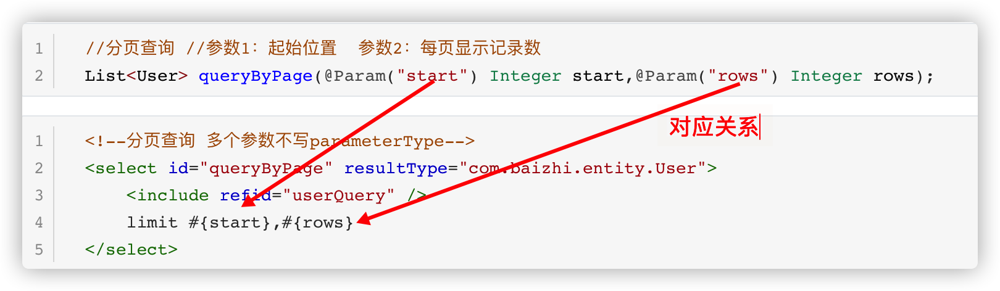


#### 3.4.5 查询总条数

```java
  //查询总条数
  Long queryTotalCounts();
```

```xml
  <!--查询总条数-->
  <select id="queryTotalCounts" resultType="Long">
      select count(id) from t_user
  </select>
```

```java
  //查询总条数
  @Test
  public void testQueryTotalCounts() {
      SqlSession sqlSession = MybatisUtil.getSqlSession();
      UserDAO userDAO = sqlSession.getMapper(UserDAO.class);
      Long counts = userDAO.queryTotalCounts();
      System.out.println("总条数为：" + counts);
  }
```


## 4.ResultType 和 ResultMap 区别

总结：resultType、resultMap都是用来对数据库中返回的结果进行封装的

* * resultType 只能封装简单类型的对象（简单类型对象：对象中没有对象类型的属性）
  * resultMap 封装复杂类型对象的 处理库表关联关系==>一对一、一对多、多对多关系时封装对象

* resultMap使用

```xml
  <!--查询所有
      resultType: list集合的泛型类型 com.baizhi.entity.User
  -->
  <!--sql标签：用来实现sql语句复用 id：相当于给sql标签中内容定义一个唯一标识-->
  <sql id="userQuery">
      select id,name as uname,age,bir
      from t_user
  </sql>

  <!--结果映射 id:resultMap标签起一个唯一标识 Type：指定封装对象的类型-->
  <resultMap id="userResultMap" type="com.baizhi.entity.User">
      <!--主键封装：id标签-->
      <id column="id" property="id" />
      <!--普通列 result-->
      <result column="uname" property="name" />
      <result column="age" property="age" />
      <result column="bir" property="bir" />
  </resultMap>
  <select id="queryAll" resultMap="userResultMap">
      <include refid="userQuery" />
  </select>
```

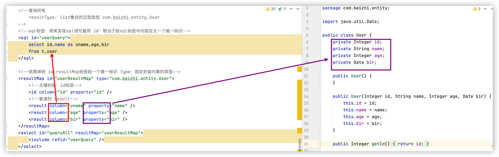

> 如果column不对应，会出现为null的情况

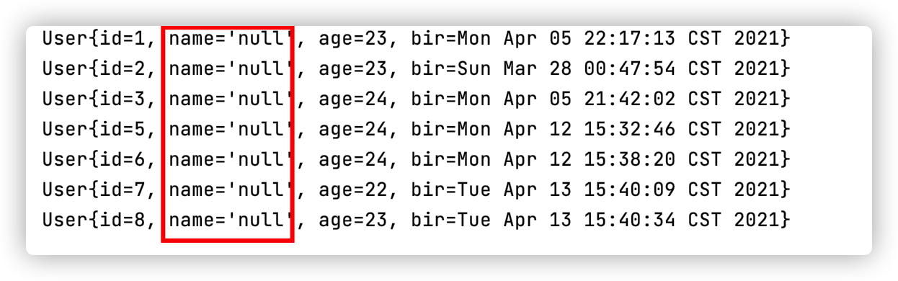


## 5.Mybatis处理数据库中关联关系

```markdown
# 1.数据库关联关系
- 一对一关联关系、一对多关联关系、多对多关联关系
- 用户信息（1） ==> 身份信息（1）
- 部门信息（1） ==> 员工信息（n）
- 老师信息（n） ==> 学生信息（n）、学生信息（n） ==> 课程信息（n）
```

### 5.1 一对一关联关系处理

```sql
create table t_person(
	id int(6) primary key auto_increment,
	name varchar(40),
	age int(3),
	cardno varchar(18) references t_info(cardno)
);

create table t_info(
	id int(6) primary key auto_increment,
	cardno varchar(18),
	address varchar(100)
);
```

#### 5.1.1 mybatis中保存用户信息同时保存身份信息

##### 5.1.1.1 身份信息保存

```java
public class Info {
  private int id;
  private String cardno;//身份证号
  private String address;//地址
  // get/set ...
}
```

```java
public interface InfoDAO {
    //保存身份信息方法
    int save(Info info);
}
```

```xml
<mapper namespace="com.baizhi.dao.InfoDAO">
    <!--保存信息-->
    <insert id="save" parameterType="com.baizhi.entity.Info" keyProperty="id" useGeneratedKeys="true">
        insert into t_info values (#{id},#{cardno},#{address})
    </insert>
</mapper>
```

```xml
<!--  注册项目中mapper.xml配置文件  -->
<mappers>
    <!--身份信息-->
    <mapper resource="com/baizhi/mapper/InfoDAO.xml"/>
</mappers>
```

```java
//测试保存
@Test
public void testSaveInfo() {
    SqlSession sqlSession = MybatisUtil.getSqlSession();
    InfoDAO infoDAO = sqlSession.getMapper(InfoDAO.class);
    Info info = new Info();
    try {
        info.setCardno("123456789012345679");
        info.setAddress("这是第二个地址");
        infoDAO.save(info);
        sqlSession.commit();
    } catch (Exception e) {
        e.printStackTrace();
        sqlSession.rollback();
    } finally {
        MybatisUtil.close(sqlSession);
    }
}
```

##### 5.1.1.1 用户信息添加

```java
public class Person {
    private int id;
    private String name;
    private int age;
    private String cardno;//外键信息 //身份证号
  	// set/get ...
}
```

```java
public interface PersonDAO {
    //保存用户信息
    int save(Person person);
}
```

```xml
<mapper namespace="com.baizhi.dao.PersonDAO">
    <!--保存信息-->
    <insert id="save" parameterType="com.baizhi.entity.Person" keyProperty="id" useGeneratedKeys="true">
        insert into t_person values (#{id},#{name},#{age},#{cardno})
    </insert>
</mapper>
```

```xml
<!--  注册项目中mapper.xml配置文件  -->
<mappers>
    <!--用户信息-->
    <mapper resource="com/baizhi/mapper/PersonDAO.xml"/>
</mappers>
```

```java
//测试保存用户信息
@Test
public void testSavePerson() {
    SqlSession sqlSession = MybatisUtil.getSqlSession();
    PersonDAO personDAO = sqlSession.getMapper(PersonDAO.class);
    Person person = new Person();
    try {
        person.setName("第二个人");
        person.setAge(25);
      	//外键信息
        person.setCardno("123456789012345679");
        personDAO.save(person);
        sqlSession.commit();
    } catch (Exception e) {
        e.printStackTrace();
        sqlSession.rollback();
    } finally {
        MybatisUtil.close(sqlSession);
    }
}
```

#### 5.1.2 mybatis处理一对一关联关系中查询

##### 5.1.2.1 根据用户信息并将他的身份信息一并查询

> Person.java

```java
public class Person {
    private int id;
    private String name;
    private int age;
    private String cardno;//外键信息 //身份证号
    //关系属性 //对象体现关系
    private Info info;//定义一个身份对象接收当前用户身份信息
  
  	// set/get...
  	// toString...
}
```

> PersonDAO.java

```java
  //查询所有用户信息
  List<Person> queryAll();
```

> PersonDAO.xml

> 注释：
>
> 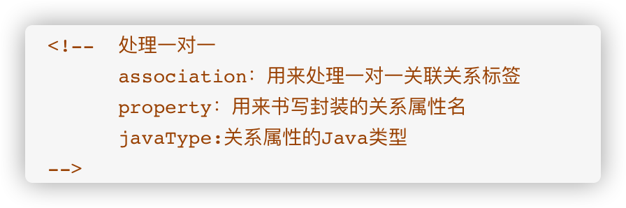

```xml
<!--用来处理结果封装-->
<resultMap id="personMap" type="com.baizhi.entity.Person">
    <id column="id" property="id"/>
    <result column="name" property="name"/>
    <result column="age" property="age"/>
    <result column="cardno" property="cardno"/>
    <!--  处理一对一 
					association：用来处理一对一关联关系标签 
					property：用来书写封装的关系属性名 
					javaType:关系属性的Java类型  
		-->
    <association property="info" javaType="com.baizhi.entity.Info">
        <id column="idd" property="id"/>
        <result column="icardno" property="cardno"/>
        <result column="address" property="address"/>
    </association>
</resultMap>
<!--查询所有信息-->
<select id="queryAll" resultMap="personMap">
    select
        p.id,
        p.name,
        p.age,
        p.cardno,
        i.id idd,
        i.cardno icardno,
        i.address
    from t_person p
    left join t_info i
    on p.cardno = i.cardno
</select>
```

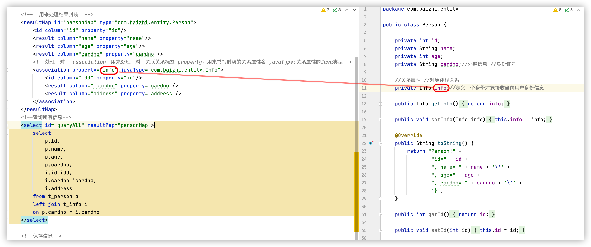

> TestPerson.java

```java
  //查询用户信息
  @Test
  public void testQueryAll() {
      SqlSession sqlSession = MybatisUtil.getSqlSession();
      PersonDAO personDAO = sqlSession.getMapper(PersonDAO.class);
      personDAO.queryAll().forEach(person -> {
          System.out.println("当前用户信息："+person+",身份信息："+person.getInfo());
      });
      MybatisUtil.close(sqlSession);
  }
```

### 5.2 一对多关联关系处理

```sql
--部门表
create table t_dept(
	id int(6) primary key auto_increment,
  name varchar(40)
);
--员工表
create table t_emp(
	id int(6) primary key auto_increment,
  name varchar(40),
  age int(3),
  bir timestamp,
  deptid int(6) references t_dept(id)
);

-- 注意：在处理一对多关联关系时，外键最好在多的一方
```

#### 5.2.1 根据部门查询员工（根据"一"查"多"）

>Dept.java

```java
public class Dept {
    private int id;
    private String name;
    //对象 关系属性
    private List<Emp> emps;//员工的关系属性
  
  	//get/set...
  	//toString...
}
```

> Emp.java

```java
public class Emp {
    private int id;
    private String name;
    private int age;
    private Date bir;
    private int deptid;
  
  	// get/set...
  	// toString...
}
  
```

> DeptDAO.java

```java
public interface DeptDAO {
    //查询所有部门，并将每个部门的员工信息查询出来
    List<Dept> queryAll();
}
```

> DeptDAO.xml

```xml
<mapper namespace="com.baizhi.dao.DeptDAO">
    <resultMap id="deptMap" type="com.baizhi.entity.Dept">
        <id column="id" property="id"/>
        <result column="name" property="name"/>
        <!--  封装员工信息  
						collection：用来处理一对多关联关系标签 
						property：用来书写封装的关系属性名 
						javaType:关系属性的Java类型 
						ofType：用来书写关系属性类型中泛型的类型
					-->
        <collection property="emps" javaType="list" ofType="com.baizhi.entity.Emp">
            <id column="eid" property="id"/>
            <result column="ename" property="name"/>
            <result column="age" property="age"/>
            <result column="bir" property="bir"/>
        </collection>
    </resultMap>
    <!--查询所有部门-->
    <select id="queryAll" resultMap="deptMap">
        select
            d.id,
            d.name,
            e.id eid,
            e.name ename,
            e.age,
            e.bir
        from t_dept d
        left join t_emp e
        on d.id = e.deptid
    </select>
</mapper>
```

> 注册：mybatis-config.xml

```xml
<!--  注册项目中mapper.xml配置文件  -->
<mappers>
    <!--部门信息-->
    <mapper resource="com/baizhi/mapper/DeptDAO.xml"/>
</mappers>
```

> 测试：TestDept.java

```java
//测试查询所有
@Test
public void testQueryAll() {
    SqlSession sqlSession = MybatisUtil.getSqlSession();
    DeptDAO deptDAO = sqlSession.getMapper(DeptDAO.class);
    deptDAO.queryAll().forEach(dept -> {
        System.out.println("部门信息："+ dept);
        dept.getEmps().forEach(emp -> {
            System.out.println("-----员工信息：" + emp);
        });
        System.out.println("-------------------------------------------");
    });
    MybatisUtil.close(sqlSession);
}
```

#### 5.2.2 查询员工并查询每个员工的部门（根据“多”查“一”）

> Emp.java

```java
public class Emp {
    private int id;
    private String name;
    private int age;
    private Date bir;
    private int deptid;
    //关系属性
    private Dept dept;
  	// get/set ...
  	// toString ...
}
```

> Dept.java

```java
public class Dept {
    private int id;
    private String name;
  	
  	// get/set ...
  	// toString ...
}
```

> EmpDAO.java

```java
  //查询所有员工并查询每个员工的部门
  List<Emp> queryAll();
```

> EmpDAO.xml

```xml
<mapper namespace="com.baizhi.dao.EmpDAO">
    <resultMap id="empMap" type="com.baizhi.entity.Emp">
        <id column="id" property="id"/>
        <result column="name" property="name"/>
        <result column="age" property="age"/>
        <result column="bir" property="bir"/>
        <!--封装部门信息-->
        <association property="dept" javaType="com.baizhi.entity.Dept">
            <id column="did" property="id"/>
            <result column="dname" property="name"/>
        </association>
    </resultMap>
    <!--  查询所有员工信息并查询员工所在部门 -->
    <select id="queryAll" resultMap="empMap">
        select e.id,e.name,e.age,e.bir,d.id did, d.name dname
        from t_emp e
        left join t_dept d on e.deptid = d.id
    </select>
</mapper>
```

> 注册：mybatis-config.xml

```xml
<!--员工信息-->
<mapper resource="com/baizhi/mapper/EmpDAO.xml"/>
```

> 测试：TestEmp.java

```java
//测试查询所有员工信息
@Test
public void testQueryAll() {
    SqlSession sqlSession = MybatisUtil.getSqlSession();
    EmpDAO empDAO = sqlSession.getMapper(EmpDAO.class);
    empDAO.queryAll().forEach(emp -> {
        System.out.println("当前员工信息：" + emp + "当前部门：" + emp.getDept());
    });
    MybatisUtil.close(sqlSession);
}
```

### 5.3 多对多关联关系处理

```sql
--学生表
create table t_student(
	id int(6) primary key auto_increment,
  name varchar(2)
);
--课程表
create table t_course(
	id int(6) primary key auto_increment,
  name varchar(2)
);
---中间表
create table t_student_course(
	id int(6) primary key auto_increment,
  sid int(6) references t_student(id),
  cid int(6) references t_course(id)
);
--注意：中间表对于任意一方属于“多”
```

* 多对多实现<span style='color:red;'>（查询学生并查询学生的选择课程）</span>

> Course.java

```java
public class Course {
    private int id;
    private String name;
  
  	// ...
}
```

> Student.java

```java
public class Student {
    private int id;
    private String name;
    //关系属性 课程 选择哪些课程
    private List<Course> courses;
  
  	// ...
}
```

> StudentDAO.java

```java
  //查询学生信息并查询所选课程
  Student queryById(int id);
```

> StudentDAO.xml

```xml
<resultMap id="studentMap" type="com.baizhi.entity.Student">
    <id column="id" property="id"/>
    <result column="name" property="name"/>
    <!--关系属性 多-->
    <collection property="courses" javaType="list" ofType="com.baizhi.entity.Course">
        <id column="cid" property="id"/>
        <result column="cname" property="name"/>
    </collection>
</resultMap>
<!--查询学生信息-->
<select id="queryById" parameterType="Integer" resultMap="studentMap">
    select
           s.id, s.name,
           c.id cid, c.name cname
    from t_student s
    left join t_student_course tc on s.id = tc.sid
    left join t_course c on tc.cid = c.id
     where s.id = #{id}
</select>
```

> 注册：mybatis-config.xml

```xml
<!--学生信息-->
<mapper resource="com/baizhi/mapper/StudentDAO.xml"/>
```

> 测试：TestStudent.java

```java
@Test
public void TestQueryById() {
    SqlSession sqlSession = MybatisUtil.getSqlSession();
    StudentDAO studentDAO = sqlSession.getMapper(StudentDAO.class);
    Student student = new Student();
    student = studentDAO.queryById(11);
    System.out.println("学生信息："+student);
    student.getCourses().forEach(course -> {
        System.out.println("------课程信息："+ course);
    });
    MybatisUtil.close(sqlSession);
}
```


